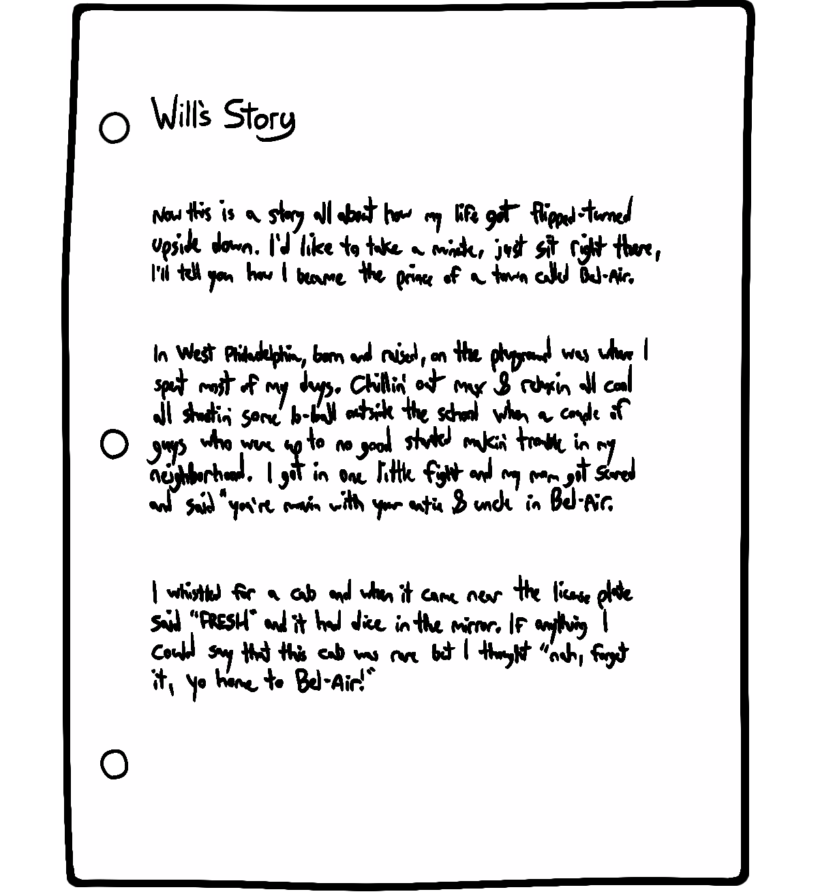

# Rendering Logic

## Built-in Declarations and Inheritance

Built-in styles for "a" tags, in Chrome 86. These styles are part of the **user-agent stylesheet**. Each browser includes their own stylesheet full of base styles like this.
```css
a {
  color: -webkit-link;
  cursor: pointer;
  text-decoration: underline;
}
```

> [!IMPORTANT]  
> It was common to use a CSS reset? to strip away many of these default user-agent styles.

## Common Global Styles

```css
/*
  1. Use a more-intuitive box-sizing model.
*/
*, *::before, *::after {
  box-sizing: border-box;
}

/*
  2. Remove default margin
*/
* {
  margin: 0;
}

/*
  3. Allow percentage-based heights in the application
*/
html, body {
  height: 100%;
}

/*
  Typographic tweaks!
  4. Add accessible line-height
  5. Improve text rendering
*/
body {
  line-height: 1.5;
  -webkit-font-smoothing: antialiased;
}

/*
  6. Improve media defaults
*/
img, picture, video, canvas, svg {
  display: block;
  max-width: 100%;
}

/*
  7. Remove built-in form typography styles
*/
input, button, textarea, select {
  font: inherit;
}

/*
  8. Avoid text overflows
*/
p, h1, h2, h3, h4, h5, h6 {
  overflow-wrap: break-word;
}

/*
  9. Create a root stacking context
*/
#root, #__next {
  isolation: isolate;
}

```

### Inheritance

```html
<style>
  p {
    color: deeppink;
  }
</style>

<p>
  I know <em>you</em> are, but what am I?
</p>
```

> [!NOTE]  
> Certain CSS properties inherit. When I apply a color to an element, that value gets passed down to all children and grand-children. In the above example pink color got applied to "em" tag, though we applied pink color to "p" tag.

```css
<style>
  p {
    border: 1px solid hotpink;
  }
</style>

<p>
  I know <em>you</em> are, but what am I?
</p>
```
> [!IMPORTANT]  
> The border value doesn't get passed down to the "em" in the above example. We still only have 1 border, and it's around the entire paragraph. If we explicitly add the same border value to both paragraphs and emphasis tags, we can see a second border within our paragraph.

> [!TIP]
> Most of the properties that inherit are typography-related, like color, font-size, text-shadow, and so on.

**List of CSS Properties that are Inherited**

* border-collapse
* border-spacing
* caption-side
* color
* cursor
* direction
* empty-cells
* font-family
* font-size
* font-style
* font-variant
* font-weight
* font-size-adjust
* font-stretch
* font
* letter-spacing
* line-height
* list-style-image
* list-style-position
* list-style-type
* list-style
* orphans
* quotes
* tab-size
* text-align
* text-align-last
* text-decoration-color
* text-indent
* text-justify
* text-shadow
* text-transform
* visibility
* white-space
* widows
* word-break
* word-spacing
* word-wrap

**Forcing inheritance**
```html
<p>
  This paragraph contains <a href="#">a hyperlink</a>!
</p>
```
The trouble is that even though color is an inheritable property, it's being overwritten by the default style, color: -webkit-link?. We can fix this by explicitly telling anchor tags to inherit their containing text color:

```css
<style>
  a {
    color: inherit;
  }
</style>

<p>
  This paragraph contains <a href="#">a hyperlink</a>!
</p>
<p style="color: red;">
  This is a red paragraph with <a href="#">another link</a>.
</p>
```

## The Cascade
In Cascading Style Sheets (CSS), a "cascade" refers to the process by which styles are applied to HTML elements, with later styles potentially overriding earlier ones based on specificity and order of declaration.

If multiple selectors each apply the same property, it pits them against each other. Two fighters enter, but only one emerges. If there is a conflict between a class and a tag, the class wins. IDs, however, are more specific than classes.

```html
<style>
  p {
    font-weight: bold;
    color: hsl(0deg 0% 10%);
  }

  .introduction {
    color: violet;
  }
</style>

<p class="introduction">
  Hello world
</p>
```

We wind up with a bold, violet paragraph. It plucks the font-weight declaration from the p tag, and the color declaration from the .introduction class.

[Article on CSS Cascading](https://2019.wattenberger.com/blog/css-cascade)


## Block and Inline Directions

English is a left-to-right language, meaning that the words are placed side-by-side, from left to right. Individual words are combined into blocks, like headings and paragraphs.

Pages are constructed out of blocks, placed one on top of the other. When a new paragraph is added to the page, it's inserted below the previous block element.

In other words, English documents have two "directions": the page consists of vertically-oriented blocks, made up of horizontally-oriented words.



### Logical Properties

The CSS logical properties and values module introduces logical properties and values that provide the ability to control layout through logical, rather than physical, direction and dimension mappings.

[Articel on CSS Logical Properties](https://developer.mozilla.org/en-US/docs/Web/CSS/CSS_logical_properties_and_values)

## The Box Model

The four aspects(Winter Layers) that make up the box model are:

1. Content (human being)
2. Padding (the polyester stuffing in the coat)
3. Border (the polyester stuffing in the coat.)
4. Margin (the person's “personal space” around him)

**Box Sizing**

The box-sizing CSS property allows us to change the rules for size calculations. The default value (**content-box**) only takes the inner content into account, but it offers an alternative value: **border-box**.

**content-box**
This is the initial and default value as specified by the CSS standard. The width and height properties include the content, but does not include the padding, border, or margin. For example, .box {width: 350px; border: 10px solid black;} renders a box that is 370px wide.

Here, the dimensions of the element are calculated as: width = width of the content, and height = height of the content. (Borders and padding are not included in the calculation.)

**border-box**
The width and height properties include the content, padding, and border, but do not include the margin. Note that padding and border will be inside of the box. For example, .box {width: 350px; border: 10px solid black;} renders a box that is 350px wide, with the area for content being 330px wide. The content box can't be negative and is floored to 0, making it impossible to use border-box to make the element disappear.

Here the dimensions of the element are calculated as: width = border + padding + width of the content, and height = border + padding + height of the content.


Instead of having to remember to swap box-sizing on every layout element, we can set it as the default value for all elements with this handy CSS snippet:
```css
*,
*::before,
*::after {
  box-sizing: border-box;
}
```

### Padding
A helpful way to think about padding is that it's "inner space". Padding can be set for all directions at once, or it can be specified for individual directions:

```css
.even-padding {
  padding: 20px;
}

.asymmetric-padding {
  padding-top: 20px;
  padding-bottom: 40px;
  padding-left: 60px;
  padding-right: 80px;
}

/* The same thing, but using ✨ logical properties ✨ */
.asymmetric-logical-padding {
  padding-block-start: 20px;
  padding-block-end: 40px;
  padding-inline-start: 60px;
  padding-inline-end: 80px;
}
```

> [!TIP]
> Many developers believe that pixels are bad for accessibility. This is true when it comes to font size, but I actually think pixels are the best unit to use for padding.

**Shorthand Properties**

```css
.two-way-padding {
  padding: 15px 30px;
}

.asymmetric-padding {
  padding: 10px 20px 30px 40px;
}

```
> [!IMPORTANT]  
> If you pass it two values, it mirrors the top to the bottom, and the right to the left. With only 3 values, we set top/right/bottom explicitly, and mirror the right value to the left.

**Overwriting values**

Following snippets are same:

```css
.box {
  padding: 48px 48px 0;
}
```

```css
.box {
  padding: 48px;
  padding-bottom: 0;
}
```

"Long-form" properties can overwrite the relevant value in shorthand properties.

> [!NOTE]  
> Please note: the order matters! The overwrite has to come after the shorthand, otherwise it won't have any effect.


### Border
### Margin

## Flow Layout
### Width Algorithms
### Height Algorithms

## Margin Collapse
### Rules of Margin Collapse
### Will it Collapse?
### Using Margin Effectively?

## Example: Agency Page